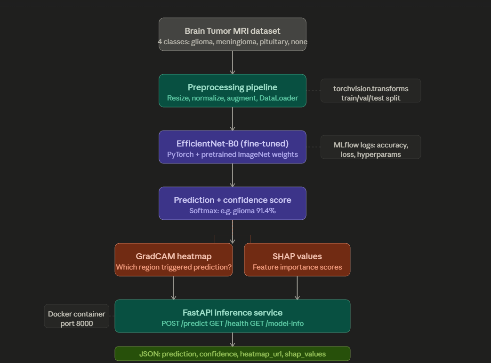
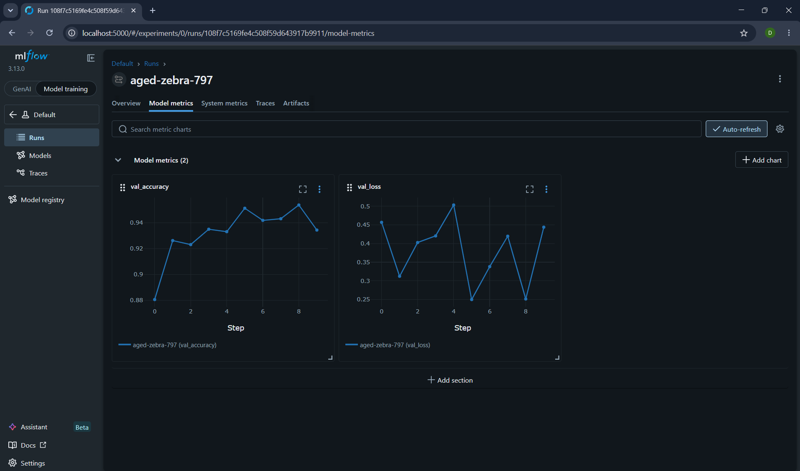

# MedVision AI
### Production-Grade Explainable Medical Imaging Platform
*Built to EU AI Act High-Risk AI System Standards*

> "Not a notebook. A production ML system — trained, served, explained, monitored, and deployed."

## Problem
Brain tumor diagnosis from MRI scans is time-critical and prone to human error. 
This system assists radiologists by automatically classifying scans and explaining 
every prediction visually, a legal requirement under the EU AI Act for high-risk 
medical AI systems.

## What it does
Classifies brain MRI scans into 4 categories (glioma, meningioma, pituitary, no tumor) 
using fine-tuned EfficientNet-B0. Every prediction includes a GradCAM heatmap showing 
exactly which brain region influenced the classification.

## Results
| Metric | Score |
|--------|-------|
| Accuracy | 95.37% |
| Precision | 95.60% |
| Recall | 95.37% |
| F1 Score | 95.31% |
| AUC-ROC | 99.14% |

## Architecture


The system is built in four layers:
- **Training layer** : PyTorch training pipeline with MLflow experiment tracking
- **Explainability layer** : GradCAM heatmaps + SHAP values on every prediction
- **Serving layer** : FastAPI inference service containerised with Docker
- **Observability layer** : Prometheus metrics + Grafana dashboards

## Tech Stack
| Component | Technology |
|---|---|
| Model | PyTorch + EfficientNet-B0 (transfer learning) |
| Experiment Tracking | MLflow |
| Inference API | FastAPI — [in progress] |
| Containerisation | Docker — [in progress] |
| CI/CD | GitHub Actions — [in progress] |
| Explainability | GradCAM + SHAP — [in progress] |
| Monitoring | Prometheus + Grafana — [in progress] |

## Project Structure

```
medvision-ai/
├── training_pipeline/   — dataset loading, model, training loop
├── inference_service/   — FastAPI inference API
├── explainability/      — GradCAM and SHAP visualisations
├── monitoring/          — Prometheus metrics
├── tests/               — pytest test suite
└── docs/                — architecture diagrams, model card
```

## MLflow Experiment Tracking


## Setup
```bash
git clone https://github.com/Kurising/medvision-ai
cd medvision-ai
pip install -r requirements.txt
python training_pipeline/train.py
```

## EU AI Act Compliance
Medical AI is classified as **high-risk** under the EU AI Act. This system addresses 
compliance requirements through:
- GradCAM explainability on every prediction
- Audit logging of all inference requests
- Model card documenting limitations and intended use
- Human oversight, system is decision-support only, not a replacement for radiologists

## Author
Dhilna Kurisingal Mathew
MSc Data Science | ML Engineering | DevOps + AWS
GitHub: github.com/Kurising