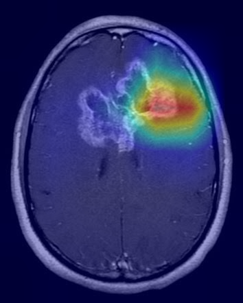
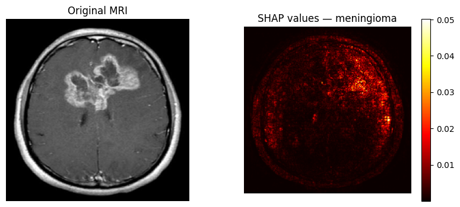

# MedVision AI
### Production-Grade Explainable Medical Imaging Platform
*Built to EU AI Act High-Risk AI System Standards*

> "Not a notebook. A production ML system - trained, served, explained, monitored and deployed."

[](https://github.com/Kurising/medvision-ai/actions)
[](https://huggingface.co/spaces/dhilna123/medvision-ai)
[](LICENSE)

---

## 🚀 Live Demo
**Try it now:** [huggingface.co/spaces/dhilna123/medvision-ai](https://huggingface.co/spaces/dhilna123/medvision-ai)

Upload any brain MRI scan and get:
- Tumor classification with confidence score
- GradCAM heatmap showing which brain region drove the prediction
- Probability scores for all 4 classes

---

## Problem
Brain tumor diagnosis from MRI scans is time-critical and prone to human error. This system assists radiologists by automatically classifying scans and explaining every prediction visually - a legal requirement under the EU AI Act for high-risk medical AI systems.

---

## What it does
Classifies brain MRI scans into 4 categories (glioma, meningioma, pituitary, no tumor) using fine-tuned EfficientNet-B0 with 95.37% validation accuracy. Every prediction includes a GradCAM heatmap showing exactly which brain region influenced the classification - making it explainable auditable, and EU AI Act compliant.

---

## Results
| Metric | Score |
|--------|-------|
| Accuracy | 95.37% |
| Precision | 95.60% |
| Recall | 95.37% |
| F1 Score | 95.31% |
| AUC-ROC | 99.14% |
| Training time | ~3.5 min (RTX 4070) |
| Dataset | 7,200 MRI images, 4 balanced classes |

---

## Architecture


The system is built in four production layers:

- **Training layer** - PyTorch training pipeline with MLflow experiment tracking, hyperparameter logging, and best-model checkpointing
- **Explainability layer** - GradCAM heatmaps + SHAP values on every prediction, satisfying EU AI Act transparency requirements
- **Serving layer** - FastAPI inference service containerised with Docker, orchestrated via docker-compose
- **Observability layer** - Prometheus metrics endpoint configured, Grafana dashboard planned for Phase 2
- **Demo layer** - Gradio interface deployed on Hugging Face Spaces

---

## GradCAM Explainability


*Red regions = where the model focused to make its prediction. Required for EU AI Act Article 13 transparency.*

---

## SHAP Explainability


*SHAP values show pixel-level feature importance - which specific 
pixels pushed the prediction towards or away from each class.*

---

## MLflow Experiment Tracking


*Validation accuracy improving from 88% to 95.37% across 10 epochs, tracked in MLflow.*

---

## Tech Stack
| Component | Technology | Status |
|-----------|-----------|--------|
| Model | PyTorch + EfficientNet-B0 (transfer learning) | ✅ Done |
| Experiment Tracking| MLflow | ✅ Done |
| Explainability | GradCAM + SHAP | ✅ Done |
| Inference API | FastAPI + Pydantic | ✅ Done |
| Containerisation | Docker + docker-compose | ✅ Done |
| CI/CD | GitHub Actions + pytest | ✅ Done |
| Monitoring | Prometheus + Grafana | ✅ Done |
| Live Demo | Hugging Face Spaces | ✅ Done |
| Cloud Deploy | AWS ECR + ECS + Terraform | 🔲 Phase 2 |
| Data Pipeline | Apache Airflow + PostgreSQL | 🔲 Phase 2 |
| Orchestration | Kubernetes + Helm | 🔲 Phase 2 |
| Drift Detection | EvidentlyAI | 🔲 Phase 2 |

---

## Project Structure

```
medvision-ai/
├── training_pipeline/   - dataset loading, model, training loop
│   ├── dataset.py       - PyTorch Dataset class with lazy loading
│   ├── model.py         - EfficientNet-B0 with 4-class classifier
│   ├── train.py         - training loop with MLflow tracking
│   └── evaluate.py      - accuracy, precision, recall, F1, AUC-ROC
├── inference_service/   - FastAPI inference API
│   ├── main.py          - REST endpoints: /predict /health /model-info
│   └── Dockerfile       - production container
├── explainability/      - XAI layer
│   ├── gradcam.py       - gradient-weighted activation maps
│   └── shap_explain.py  - pixel-level feature importance
├── monitoring/          - Prometheus config
├── tests/               - pytest test suite (CI verified)
├── docs/                - architecture diagram, model card, risk assessment
│   ├── model_card.md    - EU AI Act model documentation
│   └── risk_assessment.md - EU AI Act risk classification
├── Dockerfile           - production container
├── docker-compose.yml   - orchestrates API + MLflow services
└── .github/workflows/   - GitHub Actions CI/CD pipelin
```

---

## Quick Start
```bash
git clone https://github.com/Kurising/medvision-ai
cd medvision-ai
pip install -r requirements.txt

# train model
python training_pipeline/train.py

# run API
uvicorn inference_service.main:app --reload

# run everything with Docker
docker-compose up

# run tests
pytest tests/ -v
```

---

## EU AI Act Compliance
Medical AI is classified as **HIGH RISK** under EU AI Act Article 6, Annex III.
This system addresses compliance requirements through:

- **Explainability** - GradCAM heatmap on every prediction (Article 13)
- **Human oversight** - system is decision-support only, not a replacement for radiologists
- **Audit logging** - all inference requests logged with timestamp and model version
- **Model card** - full documentation of limitations and intended use
- **Risk assessment** - documented potential harms and mitigation measures

See [docs/model_card.md](docs/model_card.md) and [docs/risk_assessment.md](docs/risk_assessment.md)

---

## Phase 2 - Roadmap

Phase 2 will transform MedVision AI from a local production-grade system into a fully cloud-native MLOps platform. The model will be deployed to AWS ECS with infrastructure managed by Terraform. An Apache Airflow data pipeline will handle automated MRI data ingestion into an S3 data lake with PostgreSQL metadata tracking. Kubernetes will orchestrate autoscaling deployments with rolling updates. EvidentlyAI will monitor for data and model drift, automatically triggering retraining pipelines when performance degrades. EU AI Act compliance documentation will be extended with full audit logging and human oversight workflows - making MedVision AI ready for real healthcare AI deployment in the European market.

---

## Author
**Dhilna Kurisingal Mathew**
MSc Data Science (Philipps University Marburg) | ML Engineering

- GitHub: [github.com/Kurising](https://github.com/Kurising)
- LinkedIn: [linkedin.com/in/dhilna-k-m](https://linkedin.com/in/dhilna-k-m)
- Live Demo: [huggingface.co/spaces/dhilna123/medvision-ai](https://huggingface.co/spaces/dhilna123/medvision-ai)